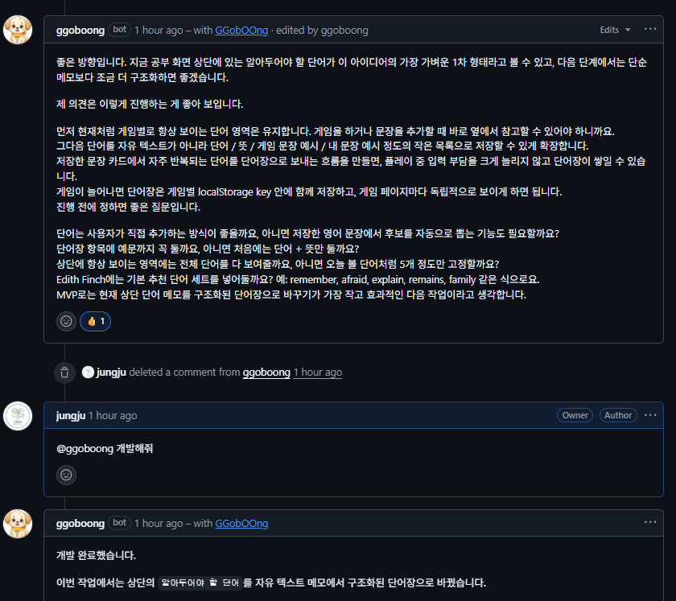

# ggoboong

`ggo`는 GitHub 이것저것 처리해주는 꼬붕 CLI입니다.

지금은 아주 단순합니다. 사용자가 CLI를 실행해서 특정 GitHub issue를 읽고, CLI를 통해 정해진 댓글을 남깁니다. 스스로 issue를 감시하거나 알아서 답변하지 않습니다. LLM, DB, 서버, Webhook, OAuth는 아직 없습니다.

## 지금 하는 일

- GitHub App installation token으로 인증
- CLI 실행 시 지정한 issue 조회
- CLI 실행 시 issue comments 조회
- 중복 댓글을 피하기 위해 이미 남긴 `ggo` 댓글이 있으면 중단
- 고정 답변 댓글 작성
- 파일에서 읽은 커스텀 댓글 작성
- tag/label로 issue 검색
- issue 검색 결과를 JSON으로 출력하고 필요하면 댓글까지 포함
- `--dry-run`이면 실제 작성 없이 댓글 본문만 출력

## 설치

Go가 설치되어 있다면 `go install`로 바로 설치할 수 있습니다.

```bash
go install github.com/jungju/ggoboong/cmd/ggo@latest
```

새 버전은 `v0.1.0` 같은 Git tag로 배포합니다. 이미 설치한 뒤에도 같은 명령을 다시 실행하면 Go module 기준의 최신 tag 버전으로 업데이트됩니다.

설치된 바이너리는 보통 `~/go/bin/ggo`에 생깁니다. `ggo` 명령이 바로 실행되지 않으면 `~/go/bin`을 `PATH`에 추가합니다.

```bash
export PATH="$HOME/go/bin:$PATH"
```

설치된 버전은 `--version`으로 확인합니다.

```bash
ggo --version
```

이 저장소에서 설치 스크립트를 실행하면 `ggo`를 빌드해서 `~/.local/bin/ggo`로 복사합니다.

```bash
./install.sh
```

원하는 설치 위치가 있으면 `GGO_INSTALL_DIR`를 지정합니다.

```bash
GGO_INSTALL_DIR=/usr/local/bin ./install.sh
```

`~/.local/bin`이 `PATH`에 없다면 shell profile에 추가합니다.

```bash
export PATH="$HOME/.local/bin:$PATH"
```

개발 중에는 그냥 빌드해도 됩니다.

```bash
go build -o ggo ./cmd/ggo
```

## GitHub App 준비

`ggo`는 GitHub App ID `3675420`을 소스에 고정해서 사용합니다. 이 값은 secret이 아니므로 설정 파일이나 `.env`에 넣을 필요가 없습니다.

GitHub App에는 repository 권한이 필요합니다.

- `Issues`: `Read and write`
- `Metadata`: `Read-only`

App을 repository에 설치한 뒤 `installation_id`를 확인하고, private key PEM 파일을 내려받습니다.

## 설정 설치

PEM을 바이너리 안에 넣어서 빌드하지 마세요. private key는 로컬 파일로 보관하고, 현재 사용자만 읽을 수 있게 두는 편이 안전합니다.

`ggo login`은 `~/.ggo/ggo.yaml`을 만들고 PEM을 `~/.ggo/github-app.private-key.pem`로 복사합니다.

```bash
ggo login \
  --installation-id 987654 \
  --private-key ./github-app.private-key.pem
```

이미 `.env`에 값이 있으면 플래그를 생략할 수 있습니다.

```bash
ggo login --force
```

생성되는 파일:

```text
~/.ggo/ggo.yaml
~/.ggo/github-app.private-key.pem
```

## 설정 파일

`ggo.yaml` 예시:

```yaml
github:
  installation_id: 987654
  private_key_path: ./github-app.private-key.pem

bot:
  dry_run: false
```

설정 파일은 아래 순서로 찾습니다.

1. `--config`로 넘긴 경로
2. `GGO_CONFIG` 환경변수 경로
3. 현재 디렉터리의 `./ggo.yaml`
4. `~/.ggo/ggo.yaml`

## 환경변수

`ggo`는 실행할 때 `.env`가 있으면 자동으로 읽습니다.

읽는 순서:

1. 현재 디렉터리의 `./.env`
2. `~/.ggo/.env`

지원하는 환경변수:

```bash
GGO_INSTALLATION_ID=987654
GGO_PRIVATE_KEY_PATH=./github-app.private-key.pem
GGO_DRY_RUN=false
GGO_CONFIG=./ggo.yaml
```

현재 프로젝트에서 쓰던 이름도 호환됩니다.

```bash
GGOBOONG_INSTALLATION_ID=987654
GGOBOONG_PRIVATE_KEY_PATH=./github-app.private-key.pem
```

환경변수는 `ggo.yaml` 값을 덮어씁니다.

## 실행

dry-run:

```bash
ggo run --owner my-org --repo my-repo --issue 123 --dry-run
```

실제 댓글 작성:

```bash
ggo run --owner my-org --repo my-repo --issue 123
```

특정 설정 파일을 쓰려면:

```bash
ggo run --owner my-org --repo my-repo --issue 123 --config ./ggo.yaml
```

## 이슈 검색

GitHub issue의 label을 태그처럼 사용해서 issue를 찾을 수 있습니다. `--tag`와 `--label`은 같은 뜻입니다.

```bash
ggo issues --owner my-org --repo my-repo --tag bug
```

여러 tag를 모두 가진 issue만 찾으려면 `--tag`를 반복합니다.

```bash
ggo issues --owner my-org --repo my-repo --tag bug --tag "help wanted"
```

특정 tag가 없는 issue만 찾으려면 `--without-tag`를 사용합니다.

```bash
ggo issues --owner my-org --repo my-repo --tag bug --without-tag done
```

가져올 issue 개수는 `--limit`으로 제한할 수 있습니다. `0`이면 제한 없이 가져옵니다.

```bash
ggo issues --owner my-org --repo my-repo --tag idea --limit 20
```

마지막 댓글 작성자가 특정 GitHub 아이디가 아닌 issue만 찾으려면 `--last-commenter-not`을 사용합니다. 댓글이 없는 issue도 결과에 포함됩니다.

```bash
ggo issues --owner my-org --repo my-repo --tag idea --last-commenter-not ggoboong
```

`ggoboong`과 `ggoboong[bot]`처럼 GitHub App bot suffix만 다른 login은 같은 작성자로 취급합니다.

자동화에서 쓰려면 `--json`을 사용합니다. JSON 출력에는 `number`, `title`, `url`, `labels`, `state`, `lastCommenter`, `lastCommentAt`이 포함됩니다.

```bash
ggo issues \
  --owner my-org \
  --repo my-repo \
  --tag idea \
  --without-tag done \
  --limit 20 \
  --last-commenter-not ggoboong \
  --json
```

댓글 전체까지 같이 받으려면 `--include-comments` 또는 `--comments`를 추가합니다. 이 플래그는 `--json`과 함께 사용합니다.

```bash
ggo issues --owner my-org --repo my-repo --tag idea --json --include-comments
```

마지막 댓글 본문으로 후보를 더 좁힐 수도 있습니다.

```bash
ggo issues --owner my-org --repo my-repo --last-comment-contains 개발
ggo issues --owner my-org --repo my-repo --last-comment-matches "개발|구현"
```

최근에 업데이트된 issue만 보려면 `--updated-after`나 같은 뜻의 `--since`를 사용합니다. 값은 `YYYY-MM-DD` 또는 RFC3339 형식입니다.

```bash
ggo issues --owner my-org --repo my-repo --updated-after 2026-05-01
```

상태는 기본이 `open`이고, `closed`나 `all`도 사용할 수 있습니다.

```bash
ggo issues --owner my-org --repo my-repo --state all --without-tag archived
```

## 커스텀 댓글 작성

파일에 적어둔 Markdown을 issue 댓글로 작성할 수 있습니다.

```bash
ggo comment --owner my-org --repo my-repo --issue 123 --body-file /tmp/comment.md
```

아래처럼 `ggoboong` GitHub App 계정으로 실제 issue thread에 댓글이 남습니다.



마지막 댓글이 이미 특정 GitHub 아이디가 남긴 댓글이면 중복 작성을 건너뛰려면 `--skip-if-last-commenter`를 사용합니다.

```bash
ggo comment \
  --owner my-org \
  --repo my-repo \
  --issue 123 \
  --body-file /tmp/comment.md \
  --skip-if-last-commenter ggoboong
```

실제 작성 없이 본문만 확인하려면 `--dry-run`을 붙입니다. 설정 파일의 `bot.dry_run: true`도 `ggo comment`에 적용됩니다.

## 댓글 중복 방지

`ggo`는 자기가 남긴 댓글인지 알아보기 위해 댓글 첫 줄에 숨김 HTML 주석을 넣습니다. 이건 GitHub 공식 기능이나 별도 설정 이름이 아니라, CLI 내부에서 중복 댓글을 피하려고 쓰는 작은 표식입니다.

```text
<!-- ggo:v1 -->
안녕하세요! ggo가 이 이슈를 확인했습니다.
```

기존 댓글 중 하나라도 같은 숨김 주석을 포함하면 새 댓글을 만들지 않고 종료합니다.
